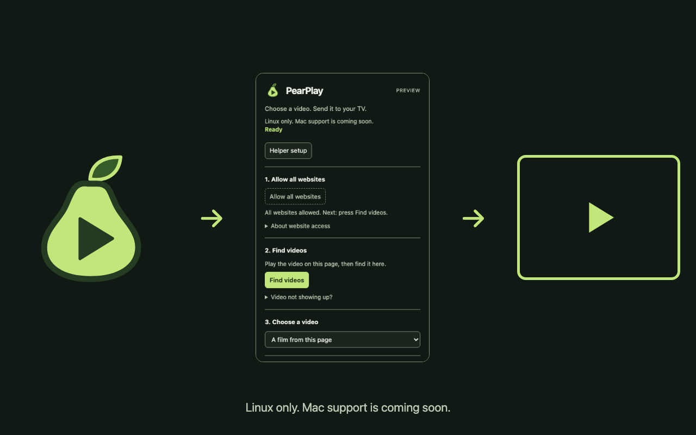

# PearPlay

### Your browser’s video. Your Apple TV.

Send a compatible video stream from your browser directly to your Apple TV—without screen mirroring, re-encoding, or a cloud relay.

**Development preview · Linux and macOS · Separate local helper required**

[Get started](#get-started) · [Compatibility](#compatibility) · [Limitations](#limitations) · [Documentation](#documentation)

<p>
  <a href="https://x.com/scottito22"></a>&nbsp;&nbsp;
  <a href="https://ko-fi.com/scottangel"></a>
</p>



*Actual extension interface with example data. The screenshot is not evidence of live TV playback.*

## What PearPlay does

PearPlay connects a browser extension to **PearPlay Helper**, a small application running on your computer. You choose a video and an Apple TV; the helper sends the stream’s address to the TV. **The Apple TV fetches the video directly from the website.**

- **No desktop mirroring or re-encoding.** Your desktop stays on your computer.
- **No PearPlay account or cloud service.** TV pairing credentials stay on your computer.
- **You choose when to send.** Website access, video selection, and destination are explicit actions.
- **Guided helper setup.** A first-run tab checks whether the helper is connected and explains installation, updates, and repair. Reopen it with **Helper setup** in the popup.
- **One helper, multiple browsers.** The packaged helper can register with Chrome, Brave, and Chromium separately. Install the extension in each browser you want to use; pairing credentials are shared under the same operating-system user.

The setup flow and helper packages are implemented, but **public installers and a Chrome Web Store listing are not available yet**. Current installation is from source. Browser registration support does not mean playback has been verified in every browser.

## Compatibility

| Platform and browser | What has been verified |
| --- | --- |
| **Linux + Chrome** | Video and audio through the extension on a tested FOX live stream, including a pre-roll-to-program transition. Pairing, reconnect, and recasting have also been observed. |
| **macOS + Chrome** | Connection and status checks using an extracted development helper package, plus browser-registration removal. **TV playback remains unverified.** |
| **Linux + Chromium** | Connection and status checks using an extracted development helper package, plus browser-registration removal. **TV playback remains unverified.** |
| **Brave on Linux or macOS** | Registration support is implemented. **End-to-end integration and playback remain unverified.** |

Windows is not supported. Other Chromium-based browsers, browser beta/dev channels, and Snap/Flatpak browser packages are not supported installer targets.

Connection checks are not playback tests. Development package extraction tests do not establish that consumer installation, upgrades, and removal work on every system. See the [verification record](assets/evidence/helper-onboarding-verification.md) and [remaining release requirements](docs/helper-onboarding.md#release-gates).

## Get started

For the current source installation, you need **Chrome**, **Python 3.11 or newer**, **uv**, and an **Apple TV on the same local network**. Keep the source checkout and Python environment in place after setup.

```sh
git clone https://github.com/jcarcinogen/PearPlay.git
cd PearPlay
uv venv --python 3.11 "$HOME/.local/share/pearplay/venv"
uv pip install --python "$HOME/.local/share/pearplay/venv/bin/python" -r requirements.txt
```

1. Open `chrome://extensions`, enable **Developer mode**, and load the checkout’s `extension/` directory.
2. Copy the extension’s actual ID and follow the [Linux/macOS helper registration instructions](docs/install.md). Source installation requires this separate registration step; opening the setup tab does not install the helper.
3. Fully quit and reopen Chrome. In the extension’s setup tab, select **Check connection**.
4. Open a video page and use the PearPlay popup to send a compatible stream.

The [installation guide](docs/install.md) covers browser registration, network permissions, troubleshooting, and removal. Linux may require a receiver-scoped firewall rule for AirPlay timing; do not disable your firewall. On macOS, allow the helper runtime’s Local Network access when requested. macOS remains experimental until TV playback is verified.

## Send a video

1. **Allow and find.** In the popup, choose **Allow all websites**, start the website’s video, and select **Find videos**.
2. **Choose the video and TV.** Select the stream, connect the helper, and choose **Find Apple TVs**. Pick a TV and enter its on-screen pairing PIN if asked.
3. **Send.** Select **Send to Apple TV**. Check that the TV has picture and sound, then pause browser playback using the website’s own controls if needed.

PearPlay does not automatically pause the browser video. One helper playback or pairing session can be active per operating-system user; end the session in the browser that started it before switching browsers.

## Limitations

- **Not every website works.** The Apple TV must be able to fetch an HTTP(S) media URL directly. Browser-only `blob:` URLs cannot be sent, and browser cookies are not transferred.
- **No DRM or access-control bypass.** Geographic restrictions and normal ad delivery still apply. PearPlay does not block ads. Use media you are authorized to access.
- **No TV pause/resume controls.** **End helper session** closes the helper connection; it does **not** confirm that TV playback stopped. Use the physical remote if playback continues.
- **All-sites access is currently required for discovery.** The popup offers a per-site grant, but **Find videos** remains disabled without all-sites access.
- **Compatibility is limited to recorded results.** A successful connection or “playing” status is not proof of picture and sound. Invalid/expired-stream handling and broader receiver lifecycle trials still need live verification.
- **Not a consumer release yet.** Public installers, macOS signing/notarization, the permanent Web Store ID, and additional browser/distribution testing remain open.

## Privacy

The extension communicates with a helper on your computer; the website delivers media directly to the TV. Pairing credentials are stored locally with user-only file permissions. The extension does not save the pairing PIN, and signed stream URLs are not included in screenshots or application logs.

No telemetry endpoint or PearPlay account/cloud integration is present in the audited first-party extension and helper sources. Your browser, dependencies, media provider, and TV still use the network; local control does not make a stream anonymous. See the [privacy audit](docs/claims.md#privacy-audit).

The optional X Money and Ko-fi links open external support pages only when selected. The popup’s badges are bundled locally; displaying them does not contact either service.

## Documentation

- [Install, connect browsers, troubleshoot, and uninstall](docs/install.md)
- [Packaged helper setup and release requirements](docs/helper-onboarding.md)
- [Control protocol and trust boundaries](contract/v1.md)
- [Helper implementation](helper/README.md) · [Tests](tests/)
- [Playback evidence and claim audit](docs/claims.md) · [Package/browser verification](assets/evidence/helper-onboarding-verification.md)
- [Landing page HTML](docs/index.html) — built, but not yet published as a website
- [Brand assets and reproducible rendering](assets/brand/README.md)

## License and affiliation

No project-wide license has been selected yet. The experimental command adapter retains its [own license and provenance](spikes/002-command/LICENSE.md); that does not license the rest of the repository.

PearPlay is independent and unaffiliated with Apple. The working name has not been trademark-cleared.
