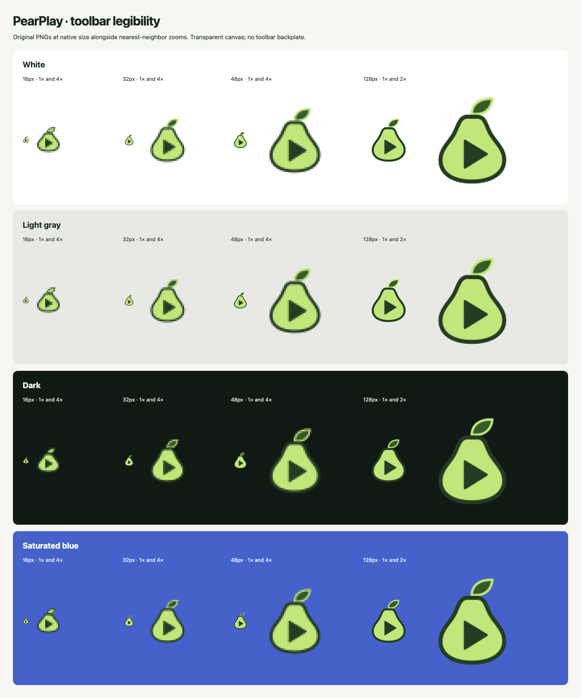
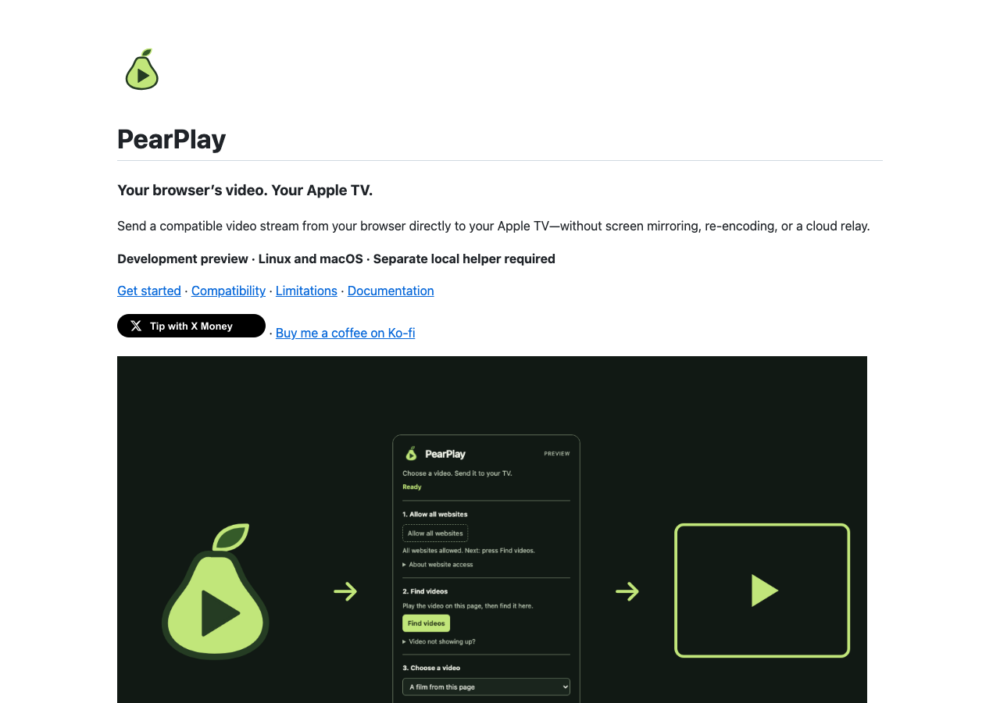

# PearPlay premium refresh — delivery report

Branch: `brand/premium-refresh`. Base: `6ce73e1` (`main` at the start). Work is local only; no push, repository setting write, Pages activation or store submission was performed. No dependency was installed. `STATUS.md` is unchanged and remains the playback authority.

## What changed

### Phase 0 — Positioning

`docs/positioning.md` sets the audience, alternatives, three differentiators, three limitations, promise and tone. The promise is **Your browser’s video. Your Apple TV.** Public copy qualifies compatible streams, Linux Chrome evidence and unverified macOS playback immediately. The source audit also found that the present implementation needs **all-sites permission**; site-only discovery was not quietly promised or implemented.

### Phase 1 — Identity

Editable pear/play mark, horizontal wordmark, 1024 app master and palette are in `assets/brand/`. The pear/play concept stays; a heavier silhouette, substantial leaf and dark play aperture replace the flat white-triangle mark. The 16px icon has a separate optical master so its aperture and silhouette survive native-size rendering. Transparent PNGs replace the existing icon paths; the manifest is byte-identical to the base.

The legibility sheet shows actual 16/32/48/128 PNGs on white, gray, dark and saturated blue, both native size and nearest-neighbor enlarged. Visual inspection found the pear/play recognizable on light and dark; light backgrounds are the more demanding case. Final aesthetic approval remains yours.



### Phase 2 — Popup and code quality

The real 360px popup now uses consistent typography, light/dark tokens, primary and secondary actions, collapsible troubleshooting and visible idle/working/empty/error/helper-playing states. Live regions and job order remain. In the follow-up simplification, the browser pause/resume section and its popup handlers were removed at the owner’s request. TV safety text remains; browser playback is controlled on the website, with no automatic pausing.

Behavior-preserving code improvements are deliberately narrow:

- One status-rendering path derives the visible phase from existing native state and outstanding actions.
- An action counter keeps working state active until outstanding work finishes; polling does not erase a failed-action warning.
- Receiver status refreshes on native state/error changes rather than keeping stale “Press Send” instructions while the helper reports playing.
- Human-readable status messages replace raw helper-state vocabulary. The permission copy admits the existing all-sites requirement.
- The directory test entry point makes the requested `node --test tests/extension` command execute all extension test modules.
- The renderer uses a disposable Chrome profile and settles navigation, image decoding and compositor frames before capture; software rasterization removes observed repeat-render pixel drift.

No refactor of the playback adapter, native transport, worker, candidate collection, permission policy, credential storage or helper installer was needed; those production files remain unchanged. This avoids creating new receiver-path risk for a visual refresh.

[Light popup](../assets/store/popup-light.png) · [Dark popup](../assets/store/popup-dark.png) · [Light store composite](../assets/store/listing-light.png) · [Dark store composite](../assets/store/listing-dark.png)

### Phase 3 — Product pages and art

README now opens with the icon, promise, immediate compatibility qualification, existing X Money SVG badge and real-popup hero. Installation, privacy and engineering links remain reachable. `docs/index.html` is a self-contained, file-openable landing page with embedded screenshots, inline assets, copy buttons, honest status and FAQ. `docs/.nojekyll` is present. Hero, feature and 1280×640 social art have editable sources; store composites are 1280×800.

**README first screen** — local rendering of the actual Markdown, not an invented GitHub browser capture:



**Landing first screen** — real `file://` render:


### Phase 4 — Reproduction and claims

Run `./scripts/render-brand-assets.sh` from the repo root. It regenerates all 26 new/replaced PNGs and the two generated HTML documents. Existing root tip-badge assets are reused. `assets/brand/README.md` documents tools, overrides, inputs, outputs and fixture boundaries. `docs/claims.md` maps public product claims to evidence and labels unverified items explicitly.

## Verification and actual output

Tools used: Node v24.18.0; Python 3.11.16; Chrome 153.0.8010.53; rsvg-convert 2.62.3; existing Markdown 3.10.2 and Pillow 12.3.0 on macOS 27.0. The existing machine-local Linux venv supplied pytest. Nothing was downloaded or installed for this refresh.

The excerpts below are from actual execution, not illustrative expected output. Full outputs are linked beside them.

### Extension suite

[Full output](../assets/evidence/extension-tests.txt)

```text
$ node --test tests/extension
✔ webRequest is attached only after optional host permission and detached on revoke (1.362875ms)
ℹ tests 21
ℹ suites 0
ℹ pass 21
ℹ fail 0
ℹ cancelled 0
ℹ skipped 0
ℹ todo 0
ℹ duration_ms 158.108916
Exit code: 0
```

### Brand suite

[Full output](../assets/evidence/brand-tests.txt)

```text
$ node --test tests/brand.test.mjs
✔ editable identity has a transparent canvas and no external assets (4.858916ms)
✔ required raster assets have exact dimensions (4.132625ms)
✔ popup manifest is unchanged by the visual refresh (0.499292ms)
ℹ tests 3
ℹ suites 0
ℹ pass 3
ℹ fail 0
ℹ cancelled 0
ℹ skipped 0
ℹ todo 0
ℹ duration_ms 86.394709
Exit code: 0
```

### Helper suite on macOS

[Full output](../assets/evidence/helper-tests.txt)

```text
$ python3.11 -m unittest discover -s tests -p 'test_helper*.py' -q
----------------------------------------------------------------------
Ran 23 tests in 0.824s

OK
Exit code: 0
```

### Complete Python suite on the Acer

[Full output](../assets/evidence/linux-pytest.txt)

```text
$ ssh -o BatchMode=yes -o ConnectTimeout=8 omarchy-acer 'cd /Volumes/IronWolf/Projects/PearPlay && PYTHONDONTWRITEBYTECODE=1 ~/.local/share/pearplay/venv/bin/python -m pytest tests -q -p no:cacheprovider'
................................................ [ 87%]
.......                                                                  [100%]
55 passed, 24 subtests passed in 1.59s
Exit code: 0
```

### Chrome rendering and UI checks

[Full command output](../assets/evidence/render-output.txt) · [Structured evidence](../assets/evidence/render-verification.json)

```text
$ ./scripts/render-brand-assets.sh
{
  "browser": "Chrome/153.0.8010.53",
  "controls": [
    "grantAll",
    "grantSite",
    "enable",
    "disable",
    "enable",
    "rescan",
    "reload",
    "hello",
    "discover",
    "status",
    "candidate",
    "receiver",
    "start",
    "stop",
    "pair",
    "host Enter"
  ],
  "captures": 18,
  "pages": 13,
  "consoleErrors": 0,
  "remotePageRequests": 0
}
Exit code: 0
```

The two schemes and working/empty/error/helper-playing states render from **the real unpacked extension document**. Browser/native responses are injected before the real popup script; the screenshot UI itself is not fabricated. These are handler/render tests, not an actual action-popup → worker → native-host handshake or a TV playback trial.

Keyboard traversal reaches enabled visible controls; focus rings are 3px. Handler checks exercise grants, discovery, candidate/receiver selection, send/end, helper status, address Enter and the masked pairing interface using no real code. `localPause` and `localResume` are never sent by the popup. Unsupported hidden pause/resume controls are not keyboard stops. No browser console errors, broken images, horizontal overflow or HTTP(S) **page-resource** requests were observed. Browser component background traffic is outside that assertion.

Copy-button checks validate exact command text with synthetic clipboard success and denied-permission boundaries. The fallback selects the command and reports that it needs manual copying; this is not a claim of testing every OS clipboard policy.

The extension was unregistered from the owned profile after rendering, and the renderer closes its owned Chrome process and removes only its own temporary profile. No daily browser, private LAN device or desktop was captured. Screenshots are from macOS Chrome; the Acer was used for the existing Python suite, not a new playback or screenshot claim.

### Repeated generation

`./scripts/render-brand-assets.sh` ran twice consecutively. SHA-256 comparison across **28 files (26 PNGs and two HTML files)** found `changed_files: []`. Same-machine reproducibility is verified; byte-identical rendering across different OS font stacks is not promised.

[Comparison and hashes](../assets/evidence/reproducibility.json)

### Artifact, privacy and contrast audit

```sh
python3.11 scripts/verify-brand-assets.py
```

[Actual JSON output](../assets/evidence/artifact-audit.json): exit 0; all five extension PNG sizes exact, transparent corners and nonempty opaque pixels; 93 citation file/range references valid; no private-path/LAN-IP pattern findings in audited marketing/document sources; manifest unchanged; social preview **56,658 bytes**. Citation-range checks supplement the source review; they do not mechanically prove the meaning of every claim.

Measured palette text pairs range from **6.20:1 to 16.52:1**, above 4.5:1. Borders are measured separately against the non-text 3:1 target. [Palette and ratios](../assets/brand/palette.md). Images were visually inspected for legibility, clipping, safety wording and privacy; only example title/receiver data appears.

`git diff --check` and `git diff --cached --check` returned exit 0 without output.

### Offline landing reference inventory

Observed from `file://` using Chrome:

- Load resources: one embedded SVG ``, one embedded PNG `<source srcset>`, one embedded PNG ``.
- CSS and JavaScript: inline. Font: system stack. No remote font, script, stylesheet or CDN.
- Local navigation: `#top`, `#how`, `#status`, `#install`, `claims.md`, `install.md`.
- External navigation only: GitHub repository, STATUS, contract and tests; the intentional X Money tip link. These do not load until followed.
- Social metadata only: `https://jcarcinogen.github.io/PearPlay/social-preview.png`; a social crawler may fetch it after publication, but opening the page makes no such request.
- Browser observations: `imagesOK: true`, `consoleErrors: 0`, `remoteRequests: []`, `width: 1440`, `scrollWidth: 1440`. Mobile captures at 390px also passed.

The complete literal navigation/resource lists are preserved in `render-verification.json`, including both desktop page passes and mobile schemes.

## Review

The final independent acceptance review also passed with empty must-fix and optional lists: [verdict](../assets/evidence/final-review.json). It covered the popup, renderer, new artifact verifier and public claims; it is source review rather than additional playback evidence.

Independent read-only code and claims reviewers found no must-fix issues. The code reviewer accidentally launched a malformed combined test command; it returned `Could not find 'tests/extension, tests/brand.test.mjs'` before testing anything. That run is not counted as passing evidence. The parent reran the correct command, `node --test tests/extension tests/brand.test.mjs`, and observed `tests 24`, `pass 24`, `fail 0`, exit 0. The separately recorded suite runs above also passed. Optional wording advice was to emphasize that the timing firewall requirement was host-specific; the product copy already says “on the tested Linux host.”

## What is not verified or not done

- No new human TV playback, real PIN pairing, live helper install, daily-profile integration or generalized stop trial. Previously recorded Linux/FOX evidence remains in STATUS; it is not extended by these screenshots.
- macOS end-to-end playback, Brave, Edge, invalid/expired streams and broader receiver lifecycle behavior remain unverified. TV pause/resume remains unavailable.
- The all-sites permission requirement remains; per-site-only discovery is not a shipped capability.
- No root project license was selected. The command adapter's scoped license is not a project-wide license. Owner decision needed before describing this as generally licensed open-source software.
- Remote metadata readback showed `topics: []`, `homepage: null`, `has_pages: false`, `license: null`. Social preview remains an owner upload; no upload occurred and its current settings UI was not inspected.
- No Chrome Web Store listing or release was submitted. No public deployment URL has been tested.

## Publishing handoff — commands not executed

Run these yourself when ready, from the repository. Publishing the feature branch alone does not replace the README on `main`.

**Push the completed branch:**

```sh
git push -u origin brand/premium-refresh
```

**Optional review PR; merge it through your normal process before enabling main/docs Pages:**

```sh
gh pr create --repo jcarcinogen/PearPlay --base main --head brand/premium-refresh --title "Refresh PearPlay identity, popup and product pages" --body "Premium product refresh with preserved playback behavior; verification and publishing notes in docs/refresh-report.md."
```

**Description and topics (reversible; not run):**

```sh
gh repo edit jcarcinogen/PearPlay --description "Send compatible browser video directly to Apple TV. Experimental, Linux-first; Chrome playback verified on a tested stream." --add-topic airplay --add-topic apple-tv --add-topic chrome-extension --add-topic linux --add-topic native-messaging
```

**After the branch is merged into main, enable Pages from `/docs`:**

```sh
gh api --method POST repos/jcarcinogen/PearPlay/pages -H 'Accept: application/vnd.github+json' -f build_type=legacy -f 'source[branch]=main' -f 'source[path]=/docs'
```

This is the documented create endpoint and requires repo Pages administration. If a site already exists by then, inspect it before using the corresponding update endpoint. Inspect build status rather than assuming HTTP acceptance is a published site:

```sh
gh api repos/jcarcinogen/PearPlay/pages --jq '{status,html_url,source}'
```

**Only after the site is actually live, set its homepage:**

```sh
gh repo edit jcarcinogen/PearPlay --homepage https://jcarcinogen.github.io/PearPlay/
```

**Social preview — manual upload, not an invented CLI upload:**

```sh
open https://github.com/jcarcinogen/PearPlay/settings
```

Under **General → Social preview → Edit → Upload an image**, choose `assets/landing/social-preview.png` (1280×640). There is no supported `gh repo edit` social-image upload flag; opening settings is the one-line handoff, not an upload claim.

Reference checked: [GitHub Pages REST create endpoint](https://docs.github.com/en/rest/pages/pages#create-a-github-pages-site). Metadata flags checked with the installed `gh repo edit --help`.
